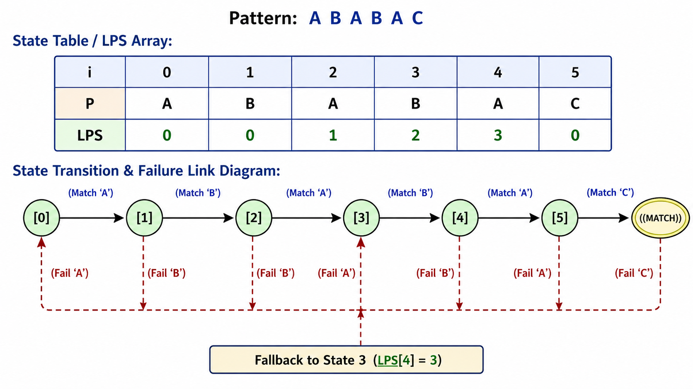

# Knuth-Morris-Pratt (KMP) Algorithm
## Linear-Time Substring Search Without Backtracking
**Presented by:** Rob Gravelle

---

## Agenda

1. **The Core Problem**: Why Naive Search Fails
2. **Historical Background**: Origins & Milestones
3. **The Core Intuition**: Avoiding Redundant Checks
4. **The Secret Weapon**: Longest Prefix Suffix (LPS) Table
5. **Algorithm Walkthrough**: Step-by-Step Execution
6. **Complexity & Benchmarks**: O(N+M) vs O(N * M)
7. **Real-World Applications**: Where KMP Shines
8. **Summary & Takeaways**

---

## 1. The Core Problem

### The Naive Substring Search Bottleneck

The Naive Substring Search Bottleneck:

When searching for a pattern in text using standard methods:
  • Compare character by character.
  • On mismatch: Shift pattern forward by 1 position and start over.

Example:
  Text:    A B A B C A B A B C
  Pattern: A B A B X
            x (Mismatch at index 4)
  Shift:     A B A B X  <-- Backtracks the text pointer!

  • Worst-Case Time Complexity: O(N * M)
  • Primary Flaw: Discards valuable structural information about characters 
    that were already successfully matched.

---


## 2. Historical Background

### The Pioneers Behind the Algorithm

<div align="center">
  
</div>

### A Breakthrough in String Processing (1970–1977)

* **Co-Inventors**: 
  * Donald Knuth & Vaughan Pratt (Stanford, 1970)
  * James H. Morris (UC Berkeley, 1970)
* **Published**: Joint paper in 1977 (*Fast Pattern Matching in Strings*, SIAM Journal on Computing).
* **Historical Significance**:
  * First deterministic linear-time algorithm for string matching.
  * Solved severe performance penalties on repetitive text (e.g., DNA strings, binary signals).

> "KMP proved that we never need to move backward in the target text."


## 3. The Core Intuition

### The "Smart Reader" Paradigm

Imagine searching for the pattern ABABAC inside a long document:

  1. You match A - B - A - B - A, but then hit a mismatch on the 6th character (C).
  2. Naive approach: Backtrack to the 2nd character in the text and start re-reading.
  3. KMP approach:
     • You already know you read A - B - A - B - A.
     • Notice that A - B - A appears at both the START (prefix) and END (suffix)
       of the matched text.
     • Keep your finger on the main text, align the prefix ABA, and continue searching. Throughout the process, the text pointer never moves backward.

---

## 4. The Secret Weapon: LPS Table

## 4. The Secret Weapon: LPS Table

### Longest Proper Prefix That Is Also a Suffix

The **Longest Prefix Suffix (LPS)** array is the key data structure that makes KMP efficient. Rather than restarting from the beginning after a mismatch, the LPS array tells the algorithm how much of the previously matched pattern can still be reused.

For the pattern `ABABAC`, the LPS table is:

| Index | Pattern Prefix | LPS Value | Explanation |
| :---: | :------------: | :-------: | :---------- |
| **0** | `A`      | **0** | No proper prefix/suffix |
| **1** | `AB`     | **0** | No match |
| **2** | `ABA`    | **1** | `A` |
| **3** | `ABAB`   | **2** | `AB` |
| **4** | `ABABA`  | **3** | `ABA` |
| **5** | `ABABAC` | **0** | No matching prefix/suffix |

Instead of restarting the search after a mismatch, KMP consults this table to determine the next pattern position while **keeping the text pointer fixed**.

---

## How KMP Avoids Backtracking: Failure Links

<div align="center">
  
</div>

The diagram visualizes how the LPS table guides the search:

- **Green arrows:** Advance to the next state after a successful character match.
- **Red arrows:** Follow the LPS (failure) links after a mismatch to preserve the longest reusable prefix.
- **Key guarantee:** **The text pointer never moves backward.** Only the pattern pointer is repositioned using the LPS table, allowing KMP to complete the search in **O(N + M)** time.

<details>
<summary><b>ASCII Representation (fallback if images cannot be displayed)</b></summary>

```text
...
```

</details>
---

## 5. Algorithm Walkthrough

### Matching Phase Mechanics

Pattern: A B A B A C

State Table / LPS Array:
 +-----+---+---+---+---+---+---+
 |  i  | 0 | 1 | 2 | 3 | 4 | 5 |
 +-----+---+---+---+---+---+---+
 |  P  | A | B | A | B | A | C |
 | LPS | 0 | 0 | 1 | 2 | 3 | 0 |
 +-----+---+---+---+---+---+---+

State Transition & Fallback Structure (Failure Link Diagram):

   (Match A)    (Match B)    (Match A)    (Match B)    (Match A)    (Match C)
 [0] --------> [1] --------> [2] --------> [3] --------> [4] --------> [5] --------> ((MATCH))
  ^             |             |            |            |            |
  |  (Fail A)   |  (Fail B)   |  (Fail A)  |  (Fail B)  |  (Fail A)  |  (Fail C)
  +-------------+-------------+            |            |            |
  |                                        v            v            v
  +----------------------------------------+------------+------------+
                                         Fallback to State 3 (LPS[4] = 3)

Key Mechanics:
  • Green Transitions: Advance state index upon matching input characters.
  • Fallback Links: Instantly shift pattern pointer j to LPS[j - 1] on mismatch.
  • Result: Guarantees zero text pointer rewinds (O(N) total comparisons).
---

Matching Phase Mechanics:

  Text:    A B A B D A B A C D A B A B C A B A B
  Pattern: A B A B C
  Match:   A B A B x  (Mismatch: 'D' vs 'C' at Pattern index 4)

Steps Taken:
  1. Look up LPS[4 - 1] -> LPS[3] = 2 ("AB").
  2. Do NOT move the text pointer backward.
  3. Jump pattern index from 4 to 2.

Next Comparison:
  Text:    A B A B D A B A C D A B A B C A B A B
  Pattern:     A B A B C
               x  (Immediate mismatch 'D' vs 'A'; advance text pointer)


## 6. Complexity Analysis

Metric Comparison:

+--------------------------+-----------------+-----------------+
| Metric                   | Naive Algorithm | KMP Algorithm   |
+--------------------------+-----------------+-----------------+
| Preprocessing Time       | O(1)            | O(M)            |
| Matching Time            | O(N * M)        | O(N)            |
| Total Worst-Case Time    | O(N * M)        | O(N + M)        |
| Auxiliary Space          | O(1)            | O(M)            |
+--------------------------+-----------------+-----------------+

Why O(N) Matching Time?
  • The text index i strictly increments and NEVER decrements.
  • The pattern index j falls back at most N times overall throughout search.
  • Amortized work per input character is strictly O(1).


---

## 7. Real-World Applications

* **Streaming Data Processing**: Ideal for non-seekable inputs (network sockets, live telemetry) where backtracking is impossible.
* **Bioinformatics**: Fast matching on small, highly repetitive alphabets (DNA sequences: {A, C, G, T}).
* **Log Analysis**: Efficient single-pass scanning of massive server log files.
* **Intrusion Detection Systems (IDS)**: Matching packet signatures in live network traffic.

---

## 8. Summary & Takeaways

1. **Zero Text Backtracking**: Processes input text strictly left-to-right.
2. **Preprocessing Power**: Invests O(M) upfront to guarantee O(N) runtime later.
3. **Deterministic**: No probabilistic risks or hash collisions (unlike Rabin-Karp).
4. **Portfolio Ready**: Clean Python implementation available in `KMP.py`.

#  Questions & Discussion

**Created by:** Rob Gravelle
**GitHub:** github.com/Rob-Gravelle
---
