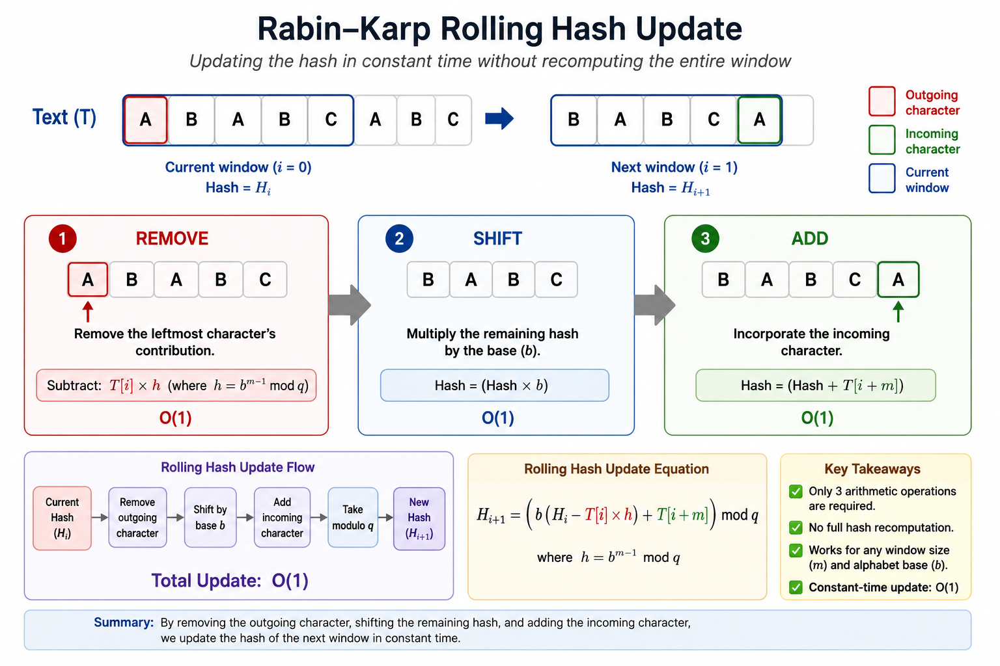

# Rabin–Karp String Search

**Author:** Rob Gravelle  
**Algorithm Category:** Substring Search  
**Average Complexity:** **O(n + m)**  
**Worst-Case Complexity:** **O(n × m)**  
**Auxiliary Space:** **O(1)**

The **Rabin–Karp algorithm** is a substring-search algorithm that uses a **polynomial rolling hash** to efficiently locate one or more patterns within a larger body of text. Rather than comparing every character of every candidate substring, Rabin–Karp transforms both the pattern and each text window into compact numerical fingerprints (hashes). Character-by-character verification is performed only when two hash values match, dramatically reducing unnecessary comparisons during average execution.

This implementation provides both the **classical single-pattern Rabin–Karp algorithm** and an extended **multi-pattern search** implementation capable of efficiently searching for multiple patterns grouped by length.

<div align="center">



</div>

<p align="center">
<b>Figure 1.</b> Rabin–Karp updates the rolling hash in constant time by removing the outgoing character, shifting the remaining hash by the alphabet base, and incorporating the incoming character. This avoids recomputing the hash for every text window.
</p>

---

# Project Contents

| Resource | Purpose |
|---|---|
| **`Rabin_Karp.py`** | Reference Python implementation supporting single and multi-pattern search |
| **`test_rabin_karp.py`** | Automated `pytest` test suite covering edge cases, collisions, Unicode, emoji, and multi-pattern search |
| **`RECRUITER_SUMMARY.md`** | Executive overview explaining the algorithm without requiring a computer science background |
| **`TECHNICAL_SPEC.md`** | Mathematical formulation, rolling hash derivation, collision handling, correctness analysis, and engineering trade-offs |
| **`RABIN_KARP_PRESENTATION.md`** | Marp-compatible presentation for interviews, classrooms, and technical talks |
| **`Images/`** | Educational diagrams and illustrations used throughout the documentation |

---

# Quick Start

```python
from Rabin_Karp import (
    rabin_karp_search,
    rabin_karp_multi_search,
)

text = "ABABDABACDABABCABAB"

# Single-pattern search
matches = rabin_karp_search(text, "ABABC")
print(matches)
# Output: [10]

# Multi-pattern search
multi_matches = rabin_karp_multi_search(
    text,
    ["ABABC", "ABABA"],
)

print(multi_matches)
# Output:
# {
#     "ABABC": [10],
#     "ABABA": [2, 7]
# }
```

---

# Key Features

- Polynomial rolling hash implementation
- Constant-time **O(1)** rolling hash updates
- Classical single-pattern substring search
- Efficient multi-pattern search grouped by pattern length
- Collision-safe verification using direct string comparison
- Support for overlapping matches
- Unicode and emoji compatibility
- Comprehensive automated test suite

---

# Time Complexity

| Operation | Complexity |
|---|:---:|
| Pattern Preprocessing | **O(m)** |
| Rolling Hash Update | **O(1)** |
| Average Search | **O(n + m)** |
| Worst-Case Search | **O(n × m)** |
| Auxiliary Space | **O(1)** |

Where:

- **n** = length of the text
- **m** = length of the pattern

---

# Typical Applications

- Plagiarism detection
- Malware and intrusion detection
- Spam filtering
- DNA and genome sequence analysis
- Content moderation
- Digital forensics
- Source-code similarity detection

---

# References

See **`REFERENCES.md`** for the original Rabin–Karp paper, foundational literature, and additional technical resources.