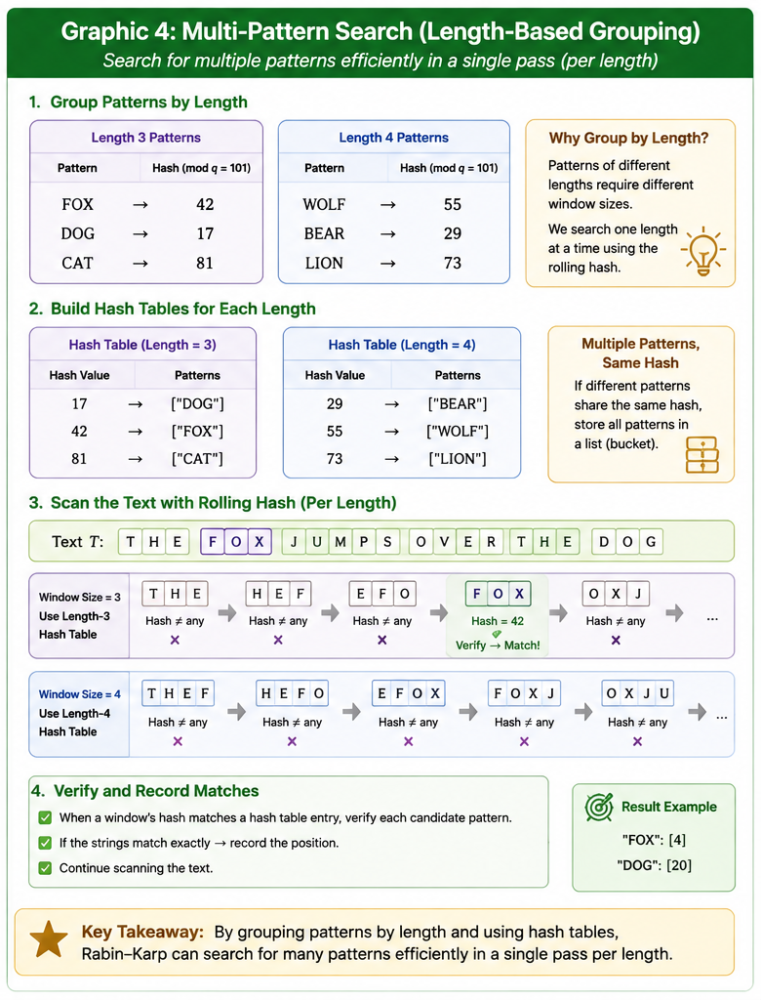

# Rabin–Karp Algorithm: Executive Summary

**Author:** Rob Gravelle  
**Target Audience:** Technical Recruiters, Engineering Managers, and Non-Technical Stakeholders

---

# What is the Rabin–Karp Algorithm?

Imagine trying to locate one fingerprint among millions stored in a forensic database. Instead of manually comparing every ridge and line of every fingerprint, each print is first converted into a compact numerical fingerprint (called a **hash**). Most records can be eliminated almost instantly by comparing these numbers alone. Only when two fingerprints share the same numerical code is a quick visual inspection performed to confirm they are truly identical.

The **Rabin–Karp algorithm** applies this same idea to text searching. Rather than comparing every character of every possible substring, it converts both the search pattern and each text window into numerical fingerprints using a **polynomial rolling hash**. Most candidate locations are rejected immediately, while only potential matches require a direct character comparison.

<b>Figure 1.</b> Rabin–Karp efficiently updates the rolling hash by removing the outgoing character, shifting the remaining hash, and incorporating the incoming character. This constant-time update eliminates the need to recompute the entire hash for every position.

---

# Why It Matters (Business & System Architecture Value)

### High-Speed Multi-Pattern Searching

Unlike many classical search algorithms that focus on a single pattern at a time, Rabin–Karp naturally supports searching for **large collections of patterns** by comparing rolling hash values against precomputed hash tables. This makes it well suited for applications such as spam filtering, malware signature detection, plagiarism analysis, and large-scale document indexing.

### Predictable Linear Performance

Under typical operating conditions, Rabin–Karp processes text in approximately **O(n + m)** time. Because each rolling hash update requires only constant-time arithmetic, performance scales efficiently even when scanning very large documents or data streams.

### Scalable Data Processing

By replacing repeated character-by-character comparisons with compact numerical fingerprints, Rabin–Karp minimizes unnecessary work while maintaining exact correctness through selective verification. This approach makes the algorithm practical for systems that process massive amounts of text continuously.

<b>Figure 2.</b> Patterns are grouped by length and stored in hash lookup tables. A rolling hash scans the text once for each pattern length, allowing many search patterns to be evaluated efficiently.

---

# Conceptual Analogy: The Conveyor Belt Inspector

Imagine a conveyor belt carrying thousands of products past a quality inspector.

- **Traditional Brute-Force Search:** The inspector stops the belt for every item, opens a detailed manual, and performs a complete inspection one product at a time.
- **Rabin–Karp:** Each product is first weighed using an ultra-fast digital scale. If the weight differs from the target, the product immediately continues down the belt. Only when the weight matches does the inspector perform a brief visual inspection to confirm it is truly the correct product.

Most items are rejected in milliseconds, allowing the inspection process to remain fast while still ensuring complete accuracy.

---

# Practical Applications

- **Plagiarism Detection** – Comparing essays, articles, and research papers against massive document repositories.
- **Spam Filtering** – Detecting known spam signatures within email and messaging systems.
- **Network Intrusion Detection** – Identifying malicious traffic patterns within network packets.
- **Bioinformatics** – Searching DNA and RNA sequences for recurring genetic patterns.
- **Digital Forensics** – Locating known file signatures or suspicious content within large storage systems.
- **Search Engines** – Supporting efficient document indexing and duplicate-content detection.

---

# Why Employers Value This Algorithm

Implementing Rabin–Karp demonstrates proficiency in several core areas of software engineering:

- Algorithm design and analysis
- Rolling hash functions
- Efficient substring searching
- Collision detection and verification
- Mathematical optimization techniques
- Scalable text-processing systems
- Clean, modular Python implementation
- Automated testing and software validation

These concepts appear throughout modern software systems, including search engines, cybersecurity platforms, plagiarism detection software, bioinformatics tools, and large-scale data processing pipelines.

---

# Key Takeaways

- Rabin–Karp transforms text into compact numerical fingerprints for efficient searching.
- Rolling hashes allow each new text window to be processed in **constant O(1) time**.
- Direct character verification guarantees correctness even when hash collisions occur.
- The algorithm naturally extends to efficient multi-pattern searching.
- Its combination of speed, scalability, and simplicity makes it a foundational algorithm in modern string processing.