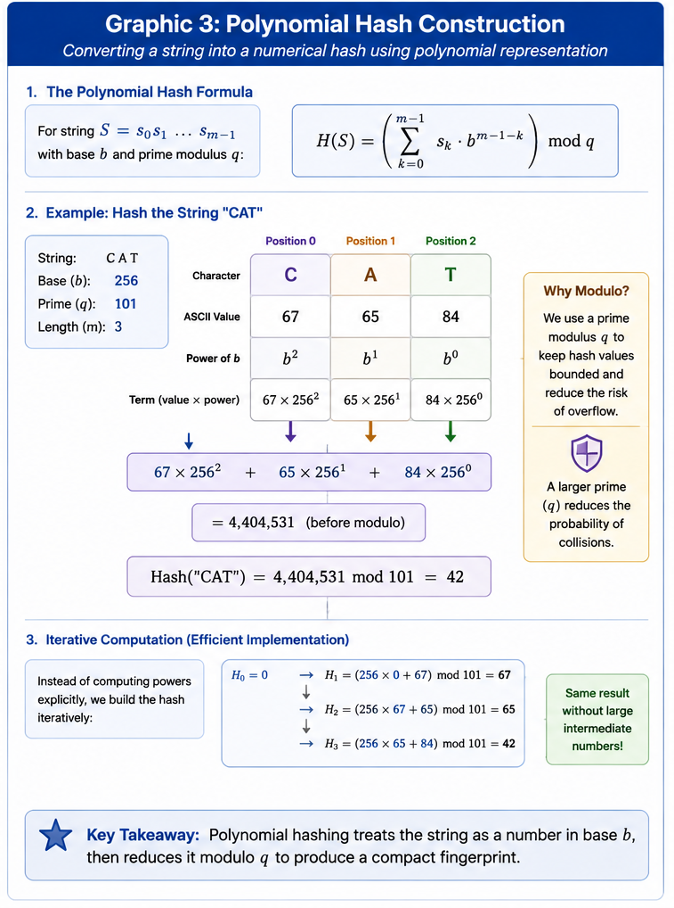

# Rabin–Karp Substring Search: Technical Specification
**Author:** Rob Gravelle  
**Target Audience:** Senior Software Engineers, Systems Architects, and Technical Interviewers

---

## Algorithmic Foundation

The Rabin–Karp algorithm maps string sequences into numerical representations using a **polynomial rolling hash**. By updating each text-window hash in constant $O(1)$ time as the window moves across the text $T$, the algorithm avoids repeated character-by-character comparison unless a candidate hash match occurs.

The algorithm has two major phases:

1. **Preprocessing:** Compute the hash of the pattern and the initial text window.
2. **Search:** Roll the text-window hash forward one position at a time and verify any hash matches to eliminate collisions.

---

## Mathematical Formulation

### 1. Hash Computation (Rabin Fingerprint)

For a string

$$
S = s_0s_1s_2\dots s_{m-1}
$$

of length $m$, using an alphabet base $b$ and prime modulus $q$, the polynomial hash is:

$$
H(S) =
\left(
\sum_{k=0}^{m-1}
s_k \cdot b^{m-1-k}
\right)
\bmod q
$$

For example, when $b=256$, each character value is incorporated as a base-256 digit.

The same hash can be computed iteratively:

$$
H_0 = 0
$$

$$
H_{k+1} = (b \cdot H_k + s_k) \bmod q
$$

This iterative form avoids explicitly computing large powers of $b$.

<div align="center">
  
</div>

<p align="center">
  <b>Figure 1.</b> Polynomial hash construction treats a string as a number in base
  <i>b</i>, then reduces the result modulo the prime <i>q</i> to produce a compact
  numerical fingerprint.
</p>

---

### 2. Rolling Hash Update Equation

Let $H_i$ be the hash of the text window beginning at index $i$:

$$
T[i \dots i+m-1]
$$

Define:

$$
h = b^{m-1} \bmod q
$$

When the window moves from position $i$ to $i+1$, the new hash is:

$$
H_{i+1}
=
\left(
b \cdot
\left(
H_i - T[i] \cdot h
\right)
+
T[i+m]
\right)
\bmod q
$$

The update performs three operations:

1. Remove the contribution of the outgoing character $T[i]$.
2. Multiply by $b$ to shift the remaining characters one position.
3. Add the incoming character $T[i+m]$.

Because each step uses a constant number of arithmetic operations, the rolling update requires $O(1)$ time.

<div align="center">
  
</div>

<p align="center">
  <b>Figure 2.</b> Rabin–Karp updates the next window hash by removing the outgoing
  character, shifting the remaining hash by the alphabet base, and incorporating
  the incoming character. The complete update requires constant <b>O(1)</b> time.
</p>

> **Implementation note:** In languages where the modulo operator may return a negative result, add $q$ when necessary to keep the hash non-negative.

---

## Pseudocode and Execution Flow

```text
function RabinKarp(Text T, Pattern P, Base b, Prime q):
    n = length(T)
    m = length(P)

    if m == 0 or n == 0 or m > n:
        return empty list

    h = pow(b, m - 1) mod q
    pattern_hash = 0
    window_hash = 0
    matches = empty list

    // Compute the pattern hash and first text-window hash
    for j = 0 to m - 1:
        pattern_hash = (b * pattern_hash + P[j]) mod q
        window_hash = (b * window_hash + T[j]) mod q

    // Slide the window across the text
    for i = 0 to n - m:
        if pattern_hash == window_hash:
            // Verify the candidate match to resolve collisions
            if T[i ... i + m - 1] == P:
                append i to matches

        if i < n - m:
            window_hash =
                (
                    b * (window_hash - T[i] * h)
                    + T[i + m]
                ) mod q

            if window_hash < 0:
                window_hash = window_hash + q

    return matches
```

---

## Asymptotic Analysis

| Metric | Best Case | Average Case | Worst Case |
|---|:---:|:---:|:---:|
| Preprocessing Time | $O(m)$ | $O(m)$ | $O(m)$ |
| Search Time | $O(n)$ | $O(n+m)$ | $O(n \times m)$ |
| Total Time | $O(n+m)$ | $O(n+m)$ | $O(n \times m)$ |
| Auxiliary Space | $O(1)$ | $O(1)$ | $O(1)$ |

Where:

- $n$ is the length of the text.
- $m$ is the length of the pattern.

The average-case search is linear because most text windows are rejected using hash comparison alone. Character-by-character verification occurs only when the pattern hash equals the current window hash.

---

## Collision Handling

A **hash collision**, also called a **spurious hit**, occurs when:

$$
H(P) = H(T[i \dots i+m-1])
$$

but:

$$
P \ne T[i \dots i+m-1]
$$

Rabin–Karp must therefore verify every candidate hash match using a direct string comparison.

This verification step guarantees correctness: hash collisions may reduce performance, but they cannot cause false matches to be returned.

<div align="center">
  
</div>

<p align="center">
  <b>Figure 3.</b> Unequal hashes immediately reject a text window. Equal hashes
  identify only a candidate match, which must be verified character by character
  to distinguish a true match from a collision.
</p>

---

## Worst-Case Behavior

Worst-case runtime occurs when many text windows share the same hash as the pattern but do not contain the same characters.

Each spurious hit forces an $O(m)$ verification. If this happens for $O(n)$ windows, total runtime becomes:

$$
O(n \times m)
$$

Frequent collisions are more likely when:

- the modulus $q$ is too small;
- the input is highly repetitive;
- the hash parameters are poorly selected; or
- an adversarial input is deliberately constructed.

---

## Collision Mitigation

Collision frequency can be reduced through careful hash-parameter selection.

Recommended strategies include:

- Use a sufficiently large prime modulus.
- Select a base that appropriately represents the input alphabet.
- Use double hashing when stronger collision resistance is required.
- Always retain direct character verification for candidate matches.

The value $q=101$ is appropriate for demonstrations and small tests, but production implementations commonly use substantially larger primes.

Collision probability depends on the hash family and input distribution; it should not be treated as universally equal to exactly $1/q$.

---

## Multi-Pattern Extension

Rabin–Karp is especially useful when searching for multiple patterns.

For a collection of $k$ equal-length patterns:

$$
\mathcal{P} = \{P_1, P_2, \dots, P_k\}
$$

the algorithm can:

1. Precompute the hash of every pattern.
2. Store the pattern hashes in a lookup structure.
3. Roll one text-window hash across the text.
4. Verify only the patterns associated with matching hash values.

The preprocessing cost is:

$$
O(k \cdot m)
$$

The average scanning cost is:

$$
O(n)
$$

Therefore, the average total complexity is:

$$
O(k \cdot m + n)
$$

This is generally more efficient than running an independent $O(n)$ scan for every pattern.

### Patterns of Different Lengths

When patterns have different lengths, they should be grouped by length. Each distinct pattern length requires its own rolling-window pass across the text.

If there are $r$ distinct pattern lengths, the average scanning work becomes approximately:

$$
O(r \cdot n)
$$

plus the cost of hashing and verifying candidate patterns.

<div align="center">
  
</div>

<p align="center">
  <b>Figure 4.</b> Multi-pattern Rabin–Karp groups patterns by length, builds a hash
  lookup table for each group, and performs one rolling-window scan for each
  distinct pattern length.
</p>

---

## Implementation-Specific Notes

The accompanying Python implementation provides:

- `rabin_karp_search()` for classical single-pattern search;
- `rabin_karp_multi_search()` for searching multiple patterns;
- support for overlapping matches;
- collision-safe verification;
- Unicode and emoji compatibility through Python's `ord()` function; and
- grouping of multi-pattern inputs by pattern length.

The multi-pattern implementation returns a dictionary mapping each input pattern to its list of starting indices.

---

## Correctness Argument

The algorithm reports a match only when both conditions are true:

1. The pattern hash equals the current text-window hash.
2. The text window is character-for-character identical to the pattern.

Because every reported match is directly verified, all returned indices are valid.

The rolling hash visits every possible text window of length $m$, so no valid starting position is skipped.

Therefore, Rabin–Karp returns all and only the correct match positions.

---

## Engineering Trade-Offs

### Advantages

- Linear average-case scanning.
- Constant-time rolling-hash updates.
- Natural support for multi-pattern search.
- Effective for streaming and large-text workloads.
- Simple collision-safe correctness model.

### Limitations

- Worst-case runtime can degrade to $O(n \times m)$.
- Performance depends on hash quality and collision frequency.
- Multiple pattern lengths require separate scanning passes.
- Direct verification is still required after every hash match.

---

## Visual Asset Filenames

Store the four graphics in the module's `Images/` directory using these filenames:

```text
Images/
├── rabin_karp_polynomial_hash.png
├── rabin_karp_rolling_hash_update.png
├── rabin_karp_collision_decision_tree.png
└── rabin_karp_multi_pattern_search.png
```

These filenames match the image references embedded throughout this specification.

---

## Summary

Rabin–Karp replaces repeated full-window comparisons with a rolling polynomial hash. Each new window hash is derived from the previous one in $O(1)$ time, while direct verification preserves exact correctness in the presence of collisions.

Its strongest practical advantage is multi-pattern search: many patterns can be represented by precomputed hashes and evaluated against a shared sequence of rolling text-window hashes.
